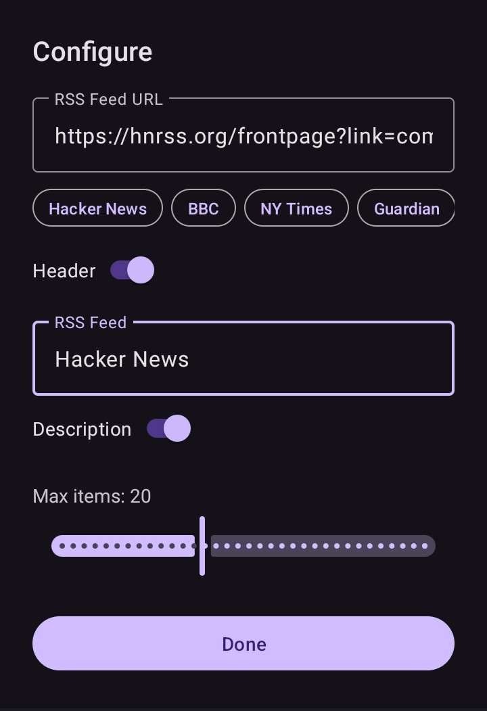

# HomeFeed - RSS Widget

HomeFeed is a customizable RSS feed widget

## Installation

[](https://f-droid.org/packages/com.byterdevs.rsswidget)
[](https://github.com/byter11/rss-widget/releases)

## Features

- Add any RSS feed URL and display articles in a widget
- Customizable widget header/title
- Show/hide article descriptions
- Set maximum number of items to display
- Material You theme support

## Screenshots

|                        |                        |
|------------------------|------------------------|
|  |  |

## Getting Started

### Prerequisites

- Android Studio Hedgehog or newer
- Android device or emulator (API 33+)

### Building

Clone the repository and open in Android Studio:

```sh
git clone https://github.com/yourusername/rsswidget.git
cd rsswidget
```

Build and run using Android Studio or:

```sh
./gradlew assembleDebug
```

## Dependencies

- AndroidX Core, AppCompat
- Material Components
- [Rome](https://rometools.github.io/rome/) (RSS parsing)
- [PrettyTime](https://www.ocpsoft.org/prettytime/) (date formatting)

## License

This project is licensed under the [Apache License 2.0](LICENSE).

## Acknowledgements

- [Rome](https://rometools.github.io/rome/)
- [PrettyTime](https://www.ocpsoft.org/prettytime/)
- AndroidX, Material Components
